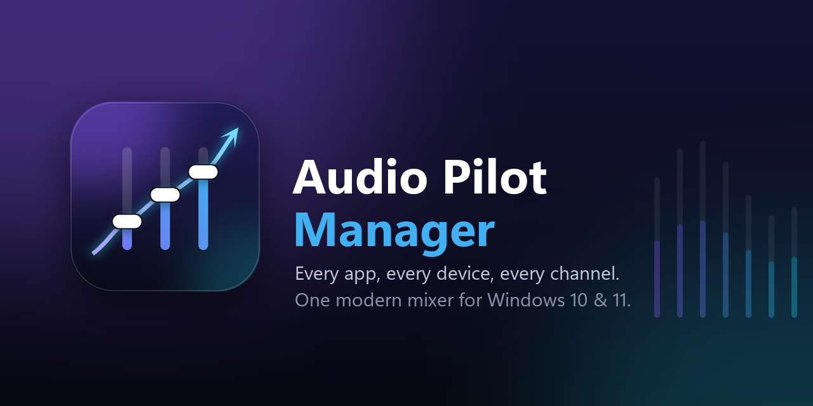
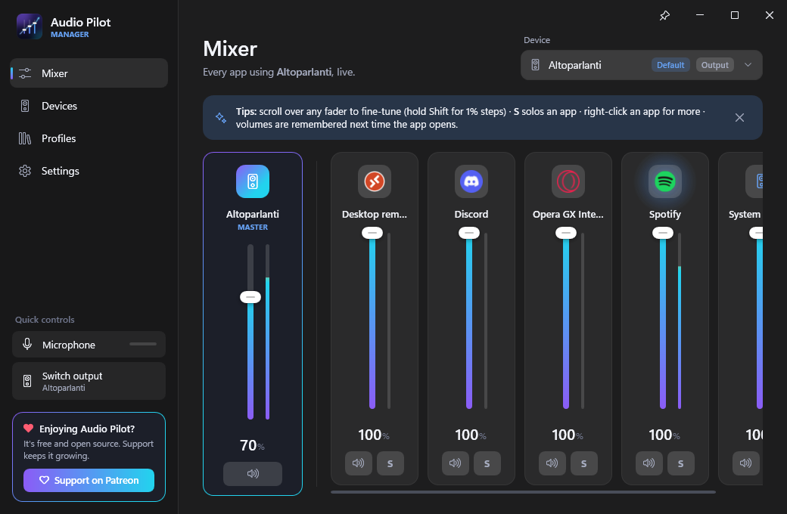
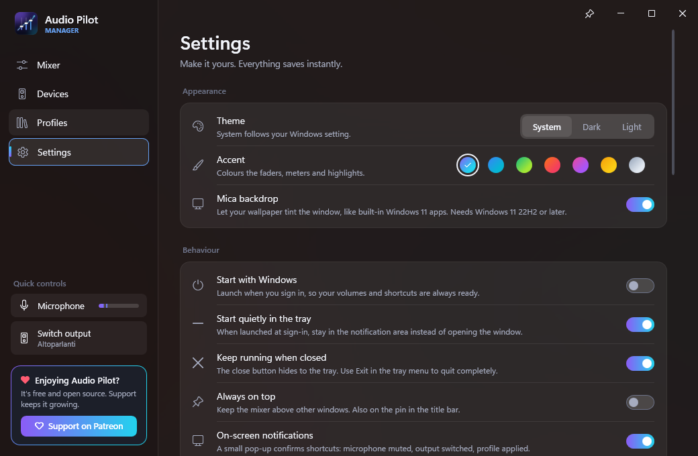
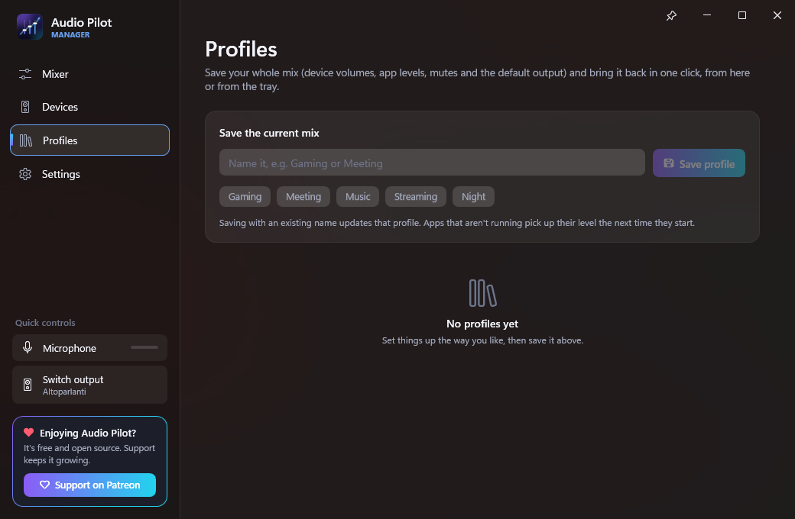

<p align="center">
  
</p>

# Audio Pilot Manager

**A modern, live audio mixer for Windows 10 and 11: every app, every device, every channel.**

Audio Pilot Manager gives you the control Windows' own volume mixer never quite did. Apps appear the instant they start making sound and disappear when they close. Each one gets a real fader, a live level meter, mute and solo. Devices get per-channel control and balance, and one click makes any device the default. It remembers how loud you like each app, saves whole mixes as profiles, and lives quietly in the tray with global shortcuts for the things you do most.

[](https://www.patreon.com/GitHixy)

[](LICENSE)


<p align="center">
  
</p>

---

## What it does

### A live mixer for every app

- **Real-time detection.** Apps show up the moment they open an audio stream and leave when they close. No refresh button, no stale entries. Browsers, games and chat apps that open several streams are grouped into one strip.
- **A fader, a meter, mute and solo per app.** Meters use a real decibel scale with peak hold, so you can see what's actually loud. **S** (solo) silences every other app on that device; press it again and everything comes back exactly as it was.
- **Icons and real names.** Apps are shown with their own icon and proper name ("Spotify", not `Spotify.exe`).
- **Any device, including microphones.** Pick a device at the top of the mixer to see which apps are using your headphones, your speakers, or your microphone.
- **A master strip.** The device's own volume and mute sit right next to its apps.
- **Hide what you don't care about.** Right-click an app to hide it; bring it back from Settings.

### Full control of your devices

- Every active speaker, headset, monitor and microphone, with a live meter, volume and mute.
- **Channels:** per-channel sliders (left/right, or all 6/8 channels on surround setups) and a **balance** slider for stereo devices.
- **Make default** in one click, or make a device the default **for calls only**.
- Plug something in or pull it out and the list updates instantly.

### Smart by default

- **Remembers app volumes.** Turn Discord down once and it comes back at that level every time it starts.
- **Profiles.** Save the whole mix (device volumes, app levels, mutes and the default output) as *Gaming*, *Meeting*, *Music*… and apply it with one click, from the app or from the tray. Apps that aren't running yet pick up their level when they start.
- **Global shortcuts** that work everywhere, even in games:

  | Shortcut | Action |
  | --- | --- |
  | `Ctrl` + `Alt` + `M` | Mute / unmute the microphone |
  | `Ctrl` + `Alt` + `N` | Mute / unmute the speakers |
  | `Ctrl` + `Alt` + `O` | Switch the default output to the next device |
  | `Ctrl` + `Alt` + `V` | Show / hide Audio Pilot Manager |

  All of them can be changed in **Settings → Keyboard shortcuts**. If another app already owns a shortcut, you're told so.
- **On-screen confirmations.** A small pill confirms what a shortcut did ("Microphone muted", "Now playing on Headphones"). It never steals focus, so it's safe in games.
- **Scroll to fine-tune.** Scroll the mouse wheel over any slider for 2% steps, or hold `Shift` for 1%.

### Lives in the tray

- **Left-click** the tray icon for a **quick mixer**: output picker, master volume, every app, and a microphone toggle, right above the taskbar.
- **Right-click** for mute microphone, mute speakers, output device, profiles, and exit.
- Starts with Windows if you like, quietly in the tray.

### Looks at home on Windows 11

- Fluent design with the **Mica** backdrop on Windows 11 (solid colours on Windows 10).
- **Dark, light, or follow Windows**, switching live when Windows does.
- Seven accent palettes: Aurora, Ocean, Emerald, Sunset, Blossom, Gold and Mono.
- Smooth, subtle animation, keyboard navigation (`Ctrl` + `1`–`4` switches pages) and screen-reader names on every control.

<p align="center">
  
  
</p>

---

## Safe by design

- **No telemetry, no accounts, no ads.** The only network request is the update check: once a day it asks GitHub for the latest release (you can turn it off, or check by hand, in Settings → Updates). Updates are downloaded only when you click Install, and are verified against the release's SHA-256 checksums before they run.
- **No administrator rights.** It runs as your normal user, and the installer installs just for you by default.
- **Only documented Windows audio interfaces** (Core Audio / WASAPI). It never installs drivers, never touches system files, and never injects into other apps. The one exception is how the "Make default" button sets the default device: through the same interface the Windows Sound control panel uses, as every audio switcher does.
- **Your data stays on your PC:** settings in `%AppData%\AudioPilotManager\settings.json`, a small log in `%LocalAppData%\AudioPilotManager\logs`. Both can be opened from **Settings → Privacy & safety**.
- **The microphone meter, explained.** Windows only measures a microphone while something is listening to it. So while the window or tray mixer is open, Audio Pilot Manager holds the same kind of silent monitoring stream the Windows Sound settings page does. Samples are released unread: nothing is recorded, stored or sent. Windows shows its mic-in-use indicator meanwhile. It stops as soon as you close the window, and you can turn it off in **Settings → Mixer → Live microphone meter**.
- **Open source** under GPL-3.0, with reproducible builds from this repository and SHA-256 checksums published with every release.

---

## Installing

Grab the latest version from the **[Releases](https://github.com/GitHixy/AudioPilotManager/releases)** page:

| Download | For |
| --- | --- |
| `AudioPilotManager-<version>-Setup.exe` | **Recommended.** Installs for your user only (no admin prompt), adds a Start menu entry and an optional "start with Windows". Uninstall from *Settings → Apps*. |
| `AudioPilotManager-<version>-win-x64-portable.zip` | A single `.exe`, no installation. Unzip anywhere and run. |
| `AudioPilotManager-<version>-win-arm64-portable.zip` | The same, for Windows on ARM. |

Nothing else is needed: the .NET runtime is built in.

> **Windows SmartScreen** may warn about an unrecognised app, because the builds aren't code-signed (certificates cost money every year). Click **More info → Run anyway**. You can check your download against `SHA256SUMS.txt` in the release first:
> ```powershell
> Get-FileHash .\AudioPilotManager-1.0.0-Setup.exe -Algorithm SHA256
> ```

**Requirements:** Windows 10 (1809 or later) or Windows 11, x64 or ARM64.

---

## Using it

| Where | What's there |
| --- | --- |
| **Mixer** | The selected device's master strip and a strip for every app on it. Right-click a strip for *Reset to 100%*, *Solo*, *Mute* and *Hide*. |
| **Devices** | Every output and input: volume, mute, meter, *Make default*, *Channels* (per-channel and balance), and ⋯ for *Default for calls* and *Show apps in mixer*. |
| **Profiles** | Save the current mix under a name, then *Apply*, *Update* or delete it. |
| **Settings** | Theme, accent and Mica; startup and tray behaviour; remembered volumes, system sounds, live mic meter and hidden apps; keyboard shortcuts; privacy; about. |
| **Sidebar** | Quick microphone toggle with a live meter, and *Switch output*. |

Closing the window keeps Audio Pilot Manager running in the tray (you can turn this off). Use **Exit** in the tray menu to quit completely.

---

## Something not working?

1. Open **Settings → Privacy & safety → Log file**.
2. Open an [issue](https://github.com/GitHixy/AudioPilotManager/issues) describing what you did and what you expected, and attach `audiopilot.log`. It contains device and app names, so have a look before posting.

**An app is missing from the mixer?** It only appears while it has an audio stream open on the device you're looking at. Check the device picker at the top, and **Settings → Mixer → Hidden apps**.

---

## Building from source

You need the [.NET 10 SDK](https://dotnet.microsoft.com/download) on Windows.

```powershell
git clone https://github.com/GitHixy/AudioPilotManager.git
cd AudioPilotManager
dotnet run --project src/AudioPilotManager
```

To make release packages, run `./build.ps1`. It writes the portable `.zip` files, the installer (if [Inno Setup 6](https://jrsoftware.org/isinfo.php) is installed) and `SHA256SUMS.txt` to `artifacts/`. Pushing a `v*` tag does the same on GitHub Actions and attaches everything to a draft release.

The logo, icon and banner are generated by `tools/make_icon.py` (Python with Pillow and NumPy): `python tools/make_icon.py`.

### How it works

- **No third-party packages.** Audio Pilot Manager talks to Windows Core Audio directly through its own small COM interop layer (`src/AudioPilotManager/Interop`).
- **Staying live:** device changes arrive through `IMMNotificationClient` and new streams through `IAudioSessionNotification`. A light 500 ms poll (1.5 s when hidden) catches everything else: apps closing, and volume changes made in other mixers. All audio work happens on the UI thread; notifications only schedule it, so there are no races.
- **Grouping:** sessions are grouped per executable per device, so one fader controls every stream an app opens.
- **Meters** run at 30 fps only while a window showing them is visible, and are drawn directly in `OnRender`, so dozens of them cost next to nothing.
- **UI:** WPF on .NET 10 with a hand-built Fluent theme (`Themes/`) that switches dark/light and accent colours live. Mica comes from the DWM system backdrop API.

```
src/AudioPilotManager
├── Audio/        devices, apps, sessions, the live service, the mic monitor
├── Interop/      Core Audio COM interfaces and Win32 calls
├── Services/     settings, tray, hotkeys, start-with-Windows, log
├── ViewModels/   the main view model, profiles, hotkeys
├── Views/        main window, pages, tray flyout, on-screen pop-up
├── Controls/     level meter, hotkey box, behaviours, converters
└── Themes/       colours, control styles and data templates
```

---

## Contributing

Issues, ideas and pull requests are all welcome on the [issue tracker](https://github.com/GitHixy/AudioPilotManager/issues).

## Support the project

Audio Pilot Manager is free and always will be. If it makes your day a little better, support on Patreon is genuinely appreciated. There's a button for it inside the app too.

[](https://www.patreon.com/GitHixy)

## Licence

Audio Pilot Manager is licensed under [GPL-3.0](LICENSE).

Icons in the app come from the Segoe Fluent Icons / Segoe MDL2 Assets fonts that ship with Windows; they are not redistributed.

---

*Not affiliated with Microsoft. Windows is a trademark of Microsoft Corporation.*
